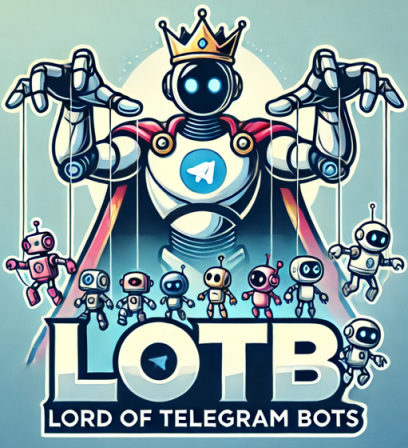

# Lotb

[](https://github.com/brokenpip3/lotb/tree/python-coverage-comment-action-data)




*One bot to rule them all, one bot to find them, one bot to bring them all and in the darkness run them.* 💍

## Why❓
<details>
<summary>
</summary>
Several years ago telegram introduced the Bot API, and since then, I have used it to automate tasks and send notifications to my groups.

While the `python-telegram-bot` library has been my go-to choice, I often found myself reinventing the wheel for each bot I created or used from others' projects.
I also had to update all my bots whenever telegram introduced new features or changed its implementation.

To eliminate this pain and save time, I decided to develop a more dry approach for my bots.
This system is plugin-based and it shares a common core logic, making it easier to define new bots with just a few lines of code.
</details>

### Features ✨

* Plugins based: you can enable or disable plugins either at runtime or in the config
* Each plugin has its own config entry and entry in the config can be overridden by the env var (useful for secrets)
* Built-in helper methods to:
  * create, register and run bot commands
  * intercept messages based on a regex and run a callback
  * use sqlite to store data
  * reply to messages or quoted messages
  * support for internal logs
  * schedule tasks for your plugin using the job queue scheduler
  * support for job queue scheduler so you can schedule tasks for your plugin
  * auth: define a list of users or authorize specific groups to interact with the bot
* Great test coverage (> 70%) ✅

### How to use it? 📦

* Clone this repo (will probably be published on pypi in the future)
* Install the dependencies with poetry
* Create a new bot on telegram and get the token
* Create a config file, see [config.example.toml](./config.example.toml), the base is something like this:
```toml
[core]
database = "lotb.db" # path to the sqlite database
admins = [''] # list of telegram user ids that can interact with the bot
debug = "false" # set to true to enable debug logs
```

* Run the bot

```bash
poetry install
poetry run lotb --config config.toml
```

### Docker 🐳

You can also run the bot using docker, the registry is `ghcr.io/brokenpip3/lotb`, just create a config file and mount it in the container:

```bash
docker run -v $(pwd)/config.toml:/config.toml ghcr.io/brokenpip3/lotb:0.0.1 --config /config.toml
```

or you can also find a docker-compose example in the [docker-compose-example.yaml](./docker-compose-example.yaml) file.

## Plugins 🔌

By default, the bot will load all the plugins in the `lotb/plugins` directory.
You can disable a plugin by removing it from the `plugins` list in the config file.
You can also make the bot load a plugin from a different directory by passing another path
to the `core.plugins_additional_directory` key in the config file.

### Available plugins

Be aware that these are the plugins that I wrote for my own use, and they may or may not be useful for you.

* [Welcome](./lotb/plugins/welcome.py): Just an example plugin that will reply to a welcome message
* [RSSfeed](./lotb/plugins/rssfeed.py): A plugin that will fetch a list of rss feeds and send the new entries every X minutes:
  ```toml
  [plugins.rssfeed]
  enabled = true # enable or disable the plugin
  chatid = "" # the chat id where the bot will send the messages
  interval = "30" # the interval in seconds
  feeds = [
      {name = "mullvad", url = "https://mullvad.net/en/blog/feed/atom/"},
  ] # list of feeds
  ```
* [Prometheus_alerts](./lotb/plugins/prometheus_alerts.py): A plugin that will fetch and send the alerts from a prometheus server:
  ```toml
  [plugins.prometheus_alerts]
  enabled = true # enable or disable the plugin
  chatid = "" # the chat id where the bot will send the messages
  alertmanager_url = "https://my.prometheus.server" # the url of the prometheus server
  alert_interval = 1 # the interval in minutes
  ```
* [Readwise](./lotb/plugins/readwise.py): A plugin that will let you add the quoted url in your Readwise reader account:
  ```toml
  [plugins.readwise]
  enabled = true # enable or disable the plugin
  token = "your_token" # can be also set as env var: LOTB_PLUGINS_READWISE_TOKEN
  ```
* [Notes](./lotb/plugins/notes.py): A plugin that will let you save notes in sqlite and retrieve them later:
  ```toml
  [plugins.notes]
  enabled = true # enable or disable the plugin
  ```
* [Memo](./lotb/plugins/memo.py): A plugin that will let you save memos based on regex or the first word and save it in separate files.
  For each category, the plugin will save the memo in a different file automatically by starting the message with the category name,
  for instance: `todo: buy milk` will save the memo in the todo file:
  ```toml
  [plugins.memo]
  generic = "path/to/generic/memo" # path to the generic memo file
  todo = "path/to/todo" # path to the todo memo file
  book = "" # path to the book memo file
  series = "" # path to the series memo file
  film = "" # path to the film memo file
  ```
* [Images](./lotb/plugins/images.py): A plugin that will let you save image ids in sqlite and call it in a group chat with `imagename.img` or search
  for images with `/image search term` using Unsplash. If no term is provided, the plugin will return the list of images saved in the database:
  ```toml
  [plugins.image]
  accesskey = "your_access_key" # can be also set as env var: LOTB_PLUGINS_IMAGE_ACCESSKEY
  secretkey = "your_secret_key" # can be also set as env var: LOTB_PLUGINS_IMAGE_SECRETKEY
  ```
* [SocialFix](./lotb/plugins/socialfix.py): A simple plugin that will fix twitter and instagram links to show the preview in telegram:
  ```toml
  [plugins.socialfix]
  enabled = true # enable or disable the plugin
* [Quote](./lotb/plugins/quote.py): A plugin that will let you save quotes in sqlite and retrieve them later. If no quoted message is provided,
  the plugin will return a random quote from the database:
  ```toml
  [plugins.quote]
  enabled = true # enable or disable the plugin
  ```

### How to add a plugin? What helper methods are available?

Check [CONTRIBUTING.md](./CONTRIBUTING.md)

## Credits 🙏

* Thanks to the [`python-telegram-bot`](https://github.com/python-telegram-bot/python-telegram-bot) dev team for the great library
* Thanks DALL-E for the great logo
* This repo has been initialized with:

```bash
nix flake init -t github:brokenpip3/my-flake-templates#python-poetry
```
